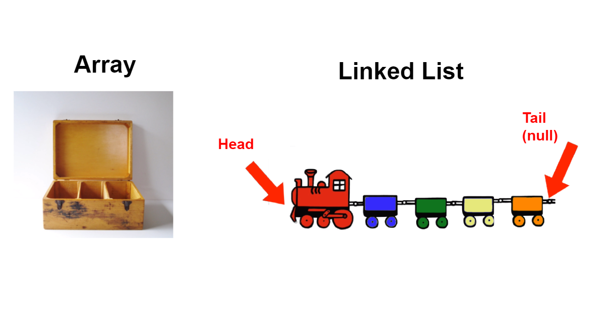

# Linked Lists
A Linked List is a data structure for storing a collection of items (like an array!).  LinkedLists are dynamic meaning that they can increase or decrease in size. Linked Lists allow you to insert data, shifting over all the other elements in the collection. See the below two images to understand the differences between an Array and a LinkedList.

Notice that the Array is static and cannot be re-sized whereas the Linked List can have more elements (which we'll call **Nodes**  added to it.)

The first and last node of a linked list usually are called the head and tail of the list, respectively. Thus, we can traverse the list starting at the head and ending at the tail. **The tail node is a special node, where the next pointer is always pointing or linking to a null reference, indicating the end of the list.**

