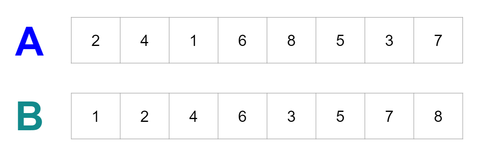

> *Here is the Hackerrank Challenge: [Merge Sort - Counting Inversions (*Hard*)](https://www.hackerrank.com/challenges/ctci-merge-sort/problem) 👈 *
  - Solution [here](https://allhackerranksolutions.blogspot.com/2019/02/merge-sort-counting-inversions-hacker.html).

# Sorting Algorithms
A Sorting Algorithm is used to rearrange a given array or list elements according to a comparison operator on the elements. The comparison operator is used to decide the new order of element in the respective data structure.

The 5 most popular sorting algorithms in Java are:
1. **Merge Sort**
2. Heap Sort
3. Insertion Sort
4. Selection Sort
5. Bubble Sort

## Merge Sort
Merge Sort uses the **divide and conquer** strategy for sorting elements in an array.  It works by recursively breaking down a problem into two or more sub-problems of the same or related type, until these become simple enough to be solved directly.  This is called a **Divide and Conquer** approach. The solutions to the sub-problems are then combined to give a solution to the original problem.

Merge Sort's runtime is **linearithmic O(n log n)**, which is much faster/ requires less operations than Insertion or Selection Sort O(n<sup>2</sup>).

Take a look at the diagram below.  Which would be faster to sort?

<br>



<br>

If you guessed **B** you're correct! 
- This is because if we divide the array into two arrays we can see that the **left-hand side** is already sorted.
- To continue sorting we compare the LHS array with the RHS array: index `0` of LHS (1) is less than index `0` of RHS.
- Indexes `0` and `1` (1, 2) are less than `0` of the RHS (3).
- When we get to index `2` (4) of LHS, it is greater than `0` of RHS (3), so we would add `3` to the newly sorted array...

The process is like this:

<br>


<br>

The Merge sort algorithm is like so:

```java
/**
 * arr = array that's being sorted
 * left = first index position
 * right = last index position
 */
mergeSort(arr, left, right) {

    if (left < right>) {

        mid = [(left + right) / 2];
        mergeSort(arr, left, mid); // here we pass in the mid point as the new "last" index position of the left array
        mergeSort(arr, mid + 1, right); // (mid + 1) represents the "first" index position of the right array

        // once the splitting is done, it combines the two completes sorted halves.
        merge(arr, left, mid, right);
    }   
}
```
