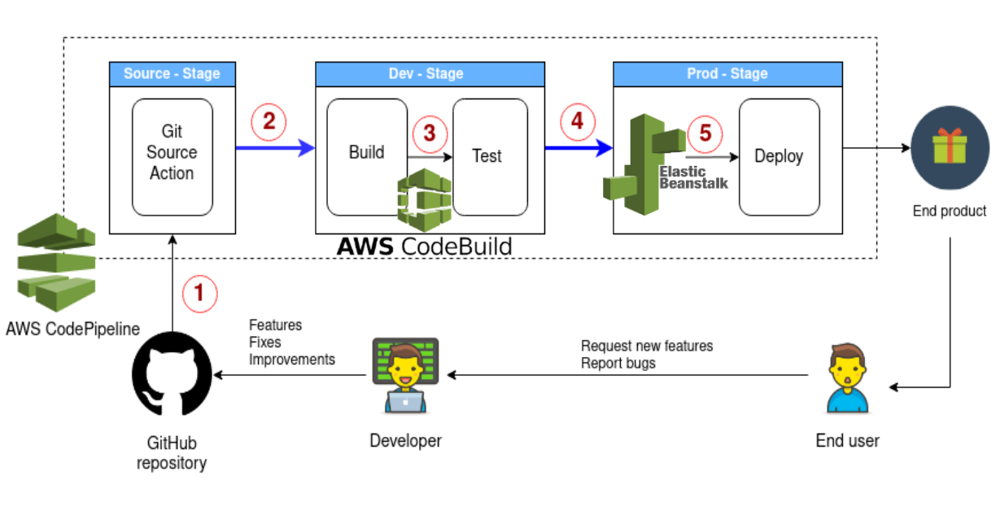

# Set up an AWS CodePipeline for CI/CD
This document wil guide you through setting up a DevOps pipeline using AWS CodePipeline and deploying it onto AWS Elastic Beanstalk running an AWS managed Docker platform, deploying the app into a Docker container.

<br>

### Tech Stack
- Spring Boot App with JDK 8
- GitHub (CI) with SonarCloud
- Docker
- AWS CodeBuild
- AWS CodeDeploy -> AWS Elastic Beanstalk
 
<br>

## Outline:
- [Step 1: Setup `Dockerfile`, `docker-compose.yml`, & `buildspec.yml` in source code](#step1)

- [Step 2: Setup Deployment Environment in Elastic Beanstalk](#step2)
- [Step 3: Connect GitHub to CodePipeline](#step3)
- [Step 4: Setup CodeBuild Project](#step4)
- [Step 5: Commit, Build, Deploy!](#step5)

Once finished, you will have a Docker application running that automatically builds your software on commit, and deploys it to the Elastic beanstalk sitting behind a load balancer for scalability. This continuous integration pipeline will allow you to worry less about your deployments and get back to focusing on feature development within your application.

<br>



<br>

## Step 1: Setup `Dockerfile`, `docker-compose.yml`, & `buildspec.yml` <a name="step1"></a>

1. In your IDE, right click on your app and create a new file named `Dockerfile`.  Write the following instructions within it:

<br>

```Dockerfile
# Declare the base image - here is a light weight JDK 8 environment setup
FROM openjdk:8-jdk-alpine

# Copy the jar produced from the mvn clean package phase from the target to the inside of the container
COPY /target/YourApp-0.0.1-SNAPSHOT.jar YourApp-0.0.1-SNAPSHOT.jar

# Expose port 5000 of the container
EXPOSE 5000

# Run the JAR when you run the container, thus executing the app
ENTRYPOINT ["java", "-jar", "/YourApp-0.0.1-SNAPSHOT.jar"]
```

<br>

> ***How is the Dockerfile used?*** *The Dockerfile is a set of instructions that builds the image.* *During the **build** phase, managed by AWS CodeDeploy, we want to build an image defining the deployment environment (container) our app will run in within Elastic Beanstalk.*

<br>

2. Right click on the root directory of your project again and create another file called `docker-compose.yml`.  Paste the following within it:

<br>

```Dockerfile
version: "1.0"
services:
  api_service:
    build: .
    restart: always
    ports:
      - 5000:5000
```

<br>

> ***How is the `docker-compose.yml` file used?*** *The Compose file defines your services by providing a way to document and configure all of the application's service dependencies (databases, queues, caches, web service APIs, etc).  Currently we only have one, without additional services like a postgres databse. The `api_service` (your app)  uses an image that’s built from the `Dockerfile` in the current directory. It then binds the container and the host machine to the exposed port, 5000*

<br>

3. Richt click on your project and create one more file named `buildspec.yml` within the project root directory. Paste the following within:

```yml
version: 1.2

phases:
  build:
    commands:
      - java -version
      - mvn clean package
artifacts:
  files:
    - 'Dockerfile'
    - target/RestApi-0.0.1-SNAPSHOT.jar
```

<br>

> ***How is the `buildspec.yml` file used?*** *During the **build** phase of our CodePipeline, AWS CodeBuild will read from this file and execute the steps we've outlined in the `build` phase: first displaying the version of java to the logs, then running `mvn clean package` to generate the `JAR` file which will be handed off to Elastic Beanstalk and run within a Docker container in the deployment phase.*

<br>

4. You're all done with your source code now. Time to `git push` it to your GitHub repository. :up:

<br>

## Step 2: <a name="step2"></a>


## Step 3: <a name="step3"></a>

## Step 4: <a name="step4"></a>

## Step 5: <a name="step5"></a>